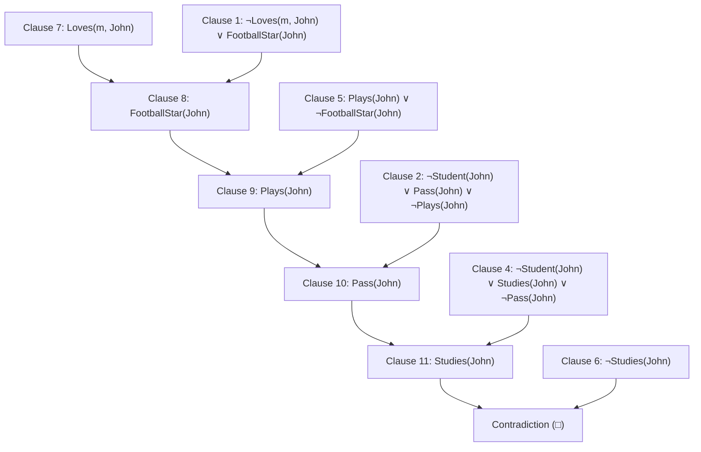

<u>Axioms</u>
1. Anyone whom Mary loves is a football star.
2. Any student who does not pass does not play.
3. John is a student.
4. Any student who does not study does not pass.
5. Anyone who does not play is not a football star.

**Prove:**
	If John does not study, then Mary does not love John. 

Expressing all statements in predicate logic.

- `Loves(m, x)`: Mary loves x
- `FootballStar(x)`: x is a football star
- `Student(x)`: x is a student
- `Pass(x)`: x passes
- `Plays(x)`; x plays
- `Studies(x)`: x studies

1. $\forall$x (Loves(m, x) $\rightarrow$ FootballStar(x))
2. $\forall$x (Student(x) $\wedge$ $\neg$Pass(x) $\rightarrow$ $\neg$Plays(x))
3. Student(John)
4. $\forall$x (Student(x) $\wedge$ $\neg$Studies(x) $\rightarrow$ $\neg$Pass(x))
5. $\forall$x ($\neg$Plays(x) $\rightarrow$ $\neg$FootballStar(x))

Converting to CNF
1. $\neg$Loves(m, x) $\vee$ FootballStar(x)
2. $\neg$Student(x) $\vee$ Pass(x) $\vee$ $\neg$Plays(x)
3. Student(John)
4. $\neg$Student(x) $\vee$ Studies(x) $\vee$ $\neg$Pass(x)
5. Plas(x) $\wedge$ $\neg$FootballStar(x)

**Negated theorem (to refute):**
	$\neg$($\neg$Studies(John)$\rightarrow$ $\neg$Loves(m, John))
	$\rightarrow$ That is: Studies(John) $\vee$ Loves(m, John)
	So the clause for negated theorem:
	**Clause 6: $\neg$Studies(John)
	Clause 7: Loves(m, John)**

Resolution Graph/Tree

_Conclusion_
We've reached a contradiction, which means out negation is fale. Thus, the original statement is true:
	If John does not study, then Mary does not love John.